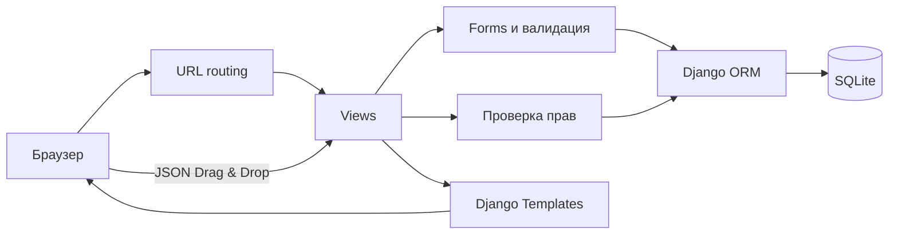
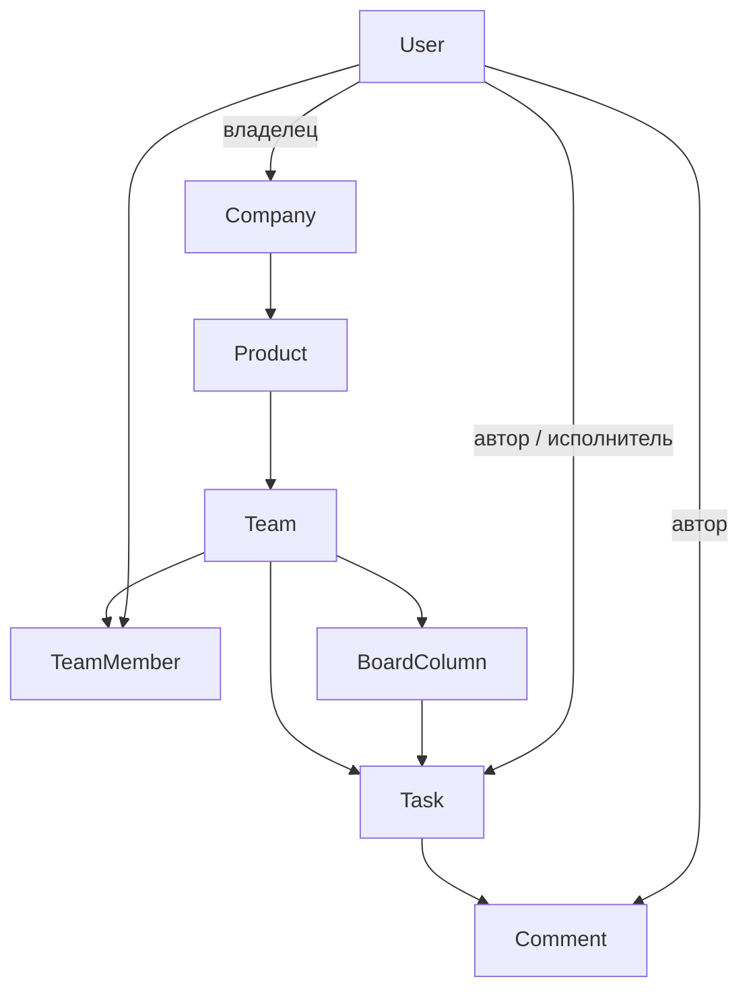

# Жир

**Жир** — учебный трекер задач на Django. Приложение объединяет компании, продукты и команды, позволяет
назначать роли участникам и вести задачи на настраиваемой Kanban-доске.

## Возможности

- регистрация, вход и выход пользователей;
- компании с владельцами и вложенными продуктами;
- команды с ролями Team Lead, Developer, Tester и Member;
- задачи типов Task, Bug и Story с приоритетом, исполнителем и сроком;
- произвольные колонки Kanban: создание, переименование, изменение порядка и удаление;
- перемещение карточек между колонками через Drag & Drop;
- комментарии к задачам;
- Dashboard с компаниями, командами, назначенными и последними задачами;
- Django Admin для управления всеми сущностями;
- серверная проверка прав, CSRF, валидация форм и ограничение доступа к объектам.

### Стек

- Python;
- Django 5.2.17;
- SQLite;
- Django Templates;
- Bootstrap 5.3;
- SortableJS 1.15.

## Запуск

### Требования

- Python 3.10 или новее;
- Git;
- доступ в интернет при первой установке зависимостей.

### Windows PowerShell

```powershell
git clone https://github.com/chekrzk/TaskTracker.git
cd TaskTracker

python -m venv .venv
.\.venv\Scripts\python.exe -m pip install -r requirements.txt
.\.venv\Scripts\python.exe manage.py migrate
.\.venv\Scripts\python.exe manage.py runserver
```

Откройте в браузере:

- приложение: <http://127.0.0.1:8000/>;
- регистрация: <http://127.0.0.1:8000/register/>;
- Django Admin: <http://127.0.0.1:8000/admin/>.

Для доступа к Django Admin создайте суперпользователя:

```powershell
.\.venv\Scripts\python.exe manage.py createsuperuser
```

### Linux и macOS

```bash
git clone https://github.com/chekrzk/TaskTracker.git
cd TaskTracker

python3 -m venv .venv
./.venv/bin/python -m pip install -r requirements.txt
./.venv/bin/python manage.py migrate
./.venv/bin/python manage.py runserver
```

### Первый сценарий

1. Зарегистрируйте пользователя.
2. Создайте компанию и продукт.
3. Создайте команду — создатель автоматически получит роль Team Lead.
4. Добавьте участников и назначьте им роли.
5. Создайте задачу или настройте колонки Kanban.
6. Перемещайте карточки между колонками и добавляйте комментарии.

Локальная база создаётся в `db.sqlite3`. Файл базы, виртуальное окружение и локальный `AGENT.md`
не отслеживаются Git.

Настройки в [config/settings.py](config/settings.py) предназначены для локальной разработки:
`DEBUG=True`, разрешены `localhost` и `127.0.0.1`. Перед публикацией необходимо вынести секретный
ключ в переменные окружения, отключить DEBUG и настроить HTTPS.

## Архитектура

Приложение использует стандартную серверную архитектуру Django:



### Модель данных



Основная иерархия:

```text
Company → Product → Team → Task → Comment
```

Дополнительные связи:

- `TeamMember` связывает пользователя с командой и хранит его роль;
- `BoardColumn` принадлежит команде и определяет положение задачи на Kanban-доске;
- `Task.column` ссылается на колонку той же команды;
- исполнитель задачи должен состоять в её команде;
- названия колонок не используются как идентификаторы.

После создания команды появляются пять стартовых колонок: `TODO`, `IN PROGRESS`, `REVIEW`,
`TESTING` и `DONE`. Это обычные записи в базе: Team Lead может изменить их названия, порядок и
количество.

### Роли и доступ

| Роль | Возможности |
| --- | --- |
| Company Owner | Редактирование компании, создание продуктов и команд |
| Team Lead | Управление командой, участниками, колонками, задачами и исполнителями |
| Developer | Просмотр и создание задач, перемещение карточек, комментарии |
| Tester | Просмотр задач, перемещение карточек, комментарии |
| Member | Просмотр команды, доски и задач |

Права проверяются в [tracker/permissions.py](tracker/permissions.py) и повторно применяются внутри
Django views. Скрытие кнопки в интерфейсе не заменяет серверную проверку.

### Структура проекта

```text
TaskTracker/
├── config/
│   ├── settings.py        # настройки Django
│   ├── urls.py            # корневые маршруты
│   ├── asgi.py
│   └── wsgi.py
├── tracker/
│   ├── migrations/        # схема и преобразования данных
│   ├── static/tracker/    # CSS и JavaScript Kanban
│   ├── templates/tracker/ # HTML-шаблоны
│   ├── admin.py           # настройка Django Admin
│   ├── forms.py           # формы и их валидация
│   ├── models.py          # предметная модель
│   ├── permissions.py     # ролевая модель
│   ├── urls.py            # маршруты приложения
│   └── views.py           # страницы и обработчики
├── manage.py
├── requirements.txt
└── README.md
```

### Основные компоненты

- [tracker/models.py](tracker/models.py) — компании, продукты, команды, членство, колонки, задачи и
  комментарии.
- [tracker/forms.py](tracker/forms.py) — регистрация и формы предметных сущностей.
- [tracker/permissions.py](tracker/permissions.py) — единая матрица разрешений.
- [tracker/views.py](tracker/views.py) — Dashboard, CRUD-операции, комментарии и JSON endpoint
  перемещения задач.
- [tracker/templates/tracker/](tracker/templates/tracker/) — серверный интерфейс на Django Templates.
- [tracker/static/tracker/js/board.js](tracker/static/tracker/js/board.js) — интеграция SortableJS,
  отправка нового `column_id` и возврат карточки при ошибке.
